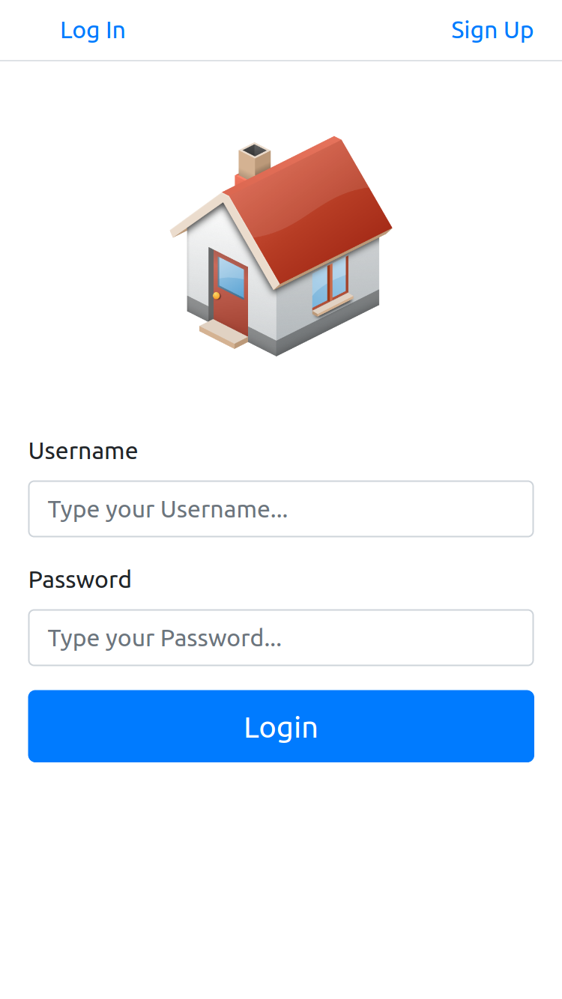
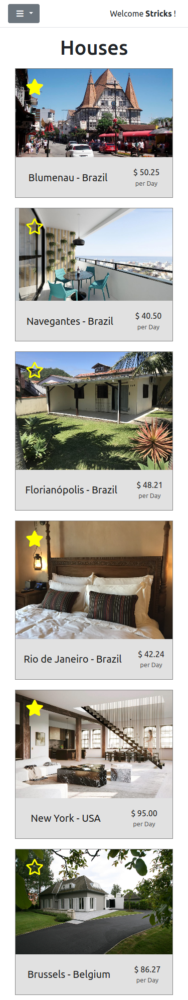

# React House Rental App

On this project, I created a Front End that uses my APIs to manage renting places. The idea is to create a simplified version of AirBnb, where every user can register their own places for rent. For now, the Front End can handle the user signup and signing (utilizing tokens for validating the sessions/saving the machine login), each user can create edit and delete their own places and add photos for their renting places, save or remove places from their favorites, schedule rents for places and and get a list of favorite places at each user.

#### Login Page


#### Places Page



## Installation

You can get a local copy of the repository please run the following commands on your terminal:

```
$ cd <folder>
$ git clone https://github.com/PabloMazurkiewicz/React-House-Retal-Front.git
```

Run `npm install` in your terminal. If you are running your own API server, you need to do this extra step: change the constant URL on: client/src/helpers/constants.js for the URL you are running your server, the default URL there is a deployed version on heroku from my API project. Run `npm start` to run on your local machine. If you wish to deploy on production, run `npm run build`.

#### Prerequisites for Running API

Node: >= 14.0

## Tests

To run the tests, on the project folder run `npm test`


## Built With

- React
- Redux
- HTML
- CSS
- Axios


## Live Version

[Demo Url](https://gallant-ptolemy-3e1fa6.netlify.app/)

## Future Implementations

- I plan to add a calendar when clicking to rent a place, showing the available dates to rent and options to create and cancel a reservation (this is already prepared on the API just need to work on the Front End for this part).
- It will be nice to have a page where the owner can check his rented places and the earnings he is making monthly with their rents. (This will need some work also on the API to return the information).
- Another feature I want to create in the future is a chat between owner and renter. (This needs to be prepared on my API first)

